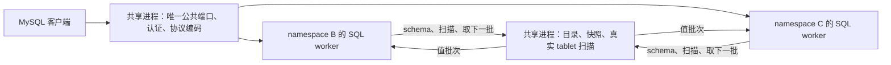

# V10：统一端口、独立 SQL worker 的流程原型

日期：2026-09-14。实验分支：`codex/namespace-sql-worker-v10`。

本轮跑通一个真实 seekdb 引擎、一个公共 MySQL 端口、两个固定 namespace 的 SQL-only worker。worker 使用原有 parser、resolver、optimizer 和执行器；读取真实 fork 表时，经 IPC 请求共享引擎扫描 tablet。杀掉一个正在查询的 worker 后，另一分支继续查询；重新连接会拉起新 worker，读取原来的持久 namespace。

这是[架构草案](namespace_sql_worker_v10_plan.md)的功能切片。IPC 暂用标准库子进程管道，尚未实现草案中的 Mio 双通道、会话复用、取消和额度调度，也没有高并发或跨平台运行结论。

## 一条命令验证

在仓库根目录运行，使用本分支已编译的二进制：

```bash
SEEKDB_FORK_PROTOTYPE_TEST_ROOT=/tmp \
python3 tools/obtest/namespace_sql_worker_prototype.py \
  --binary build_release/src/observer/seekdb
```

脚本自动创建隔离实例、选择空闲端口、准备两列整数表、调用内核 fork、连接两个 worker 并执行断言。完成后停止实例、归档实验数据；终端和 `experiment.jsonl` 输出实例目录、公共端口、三个进程 PID 和 PASS。Python 只负责驱动及验收，namespace/catalog/tablet 和查询执行均由内核处理。

测试实例同时设置 `SEEKDB_NAMESPACE_FORK_PROTOTYPE=6` 和 `SEEKDB_NAMESPACE_SQL_WORKER_PROTOTYPE=1`。已有 V9 原型开关保持原义，V10 开关默认关闭。

## 实际执行路径



- 登录使用已有地址 `__fork_ns_<id>__数据库名` 选择 worker，例如 PyMySQL 的 `database="__fork_ns_2__db1"`。后续普通 `SELECT ... FROM t1` 在该 namespace 内解析。这里只接入 fork 出来的 namespace，编号 1 的源仍通过原有管理连接使用。
- 共享入口完成现有 root 认证；本轮不实现分支独立用户/权限。连接记录 namespace 和激活代次。worker 更换后，旧代次连接再次执行时失败，不能进入新 worker。
- worker 单独初始化 SQL 所需的 schema、plan cache、表达式、统计监控、DAS、SQL 内存管理等模块，不启动自己的存储、WAL、LS 或合并服务。每个请求创建临时 SQL session，完整的连接级 SQL session 状态尚未迁移。
- worker 通过已有 namespace schema 查找入口按需取得序列化 schema，并持有进程内副本。共享引擎原型已有的 schema holder 仍存在；本轮没有消除它们。
- 共享引擎取得查询快照，在入口 session 中保留，直到该请求及其扫描清理完成。worker 在只读专用入口使用这个快照，不初始化本地事务服务，不伪造写事务提交。
- worker 的 DAS 绑定 `RemoteTabletScan`。IPC 只发送表/tablet 身份、列号和主键范围等值；引擎构造自己的 `ObTableScanParam`，调用真实 `ObITabletScan`，把 `DatumRow` 转为每批最多 32 行的值。
- 关闭新式存储下推后，旧路径仍存在 SQL 表达式过滤回调。本轮在 worker 中执行这些回调，再应用扫描 `LIMIT/OFFSET`；排序、投影和聚合继续使用原 SQL 算子。
- 扫描句柄由共享端当前请求拥有。正常关闭、IPC 断链或 worker 被杀都会回收扫描迭代器及 namespace 临时访问引用；结束请求后释放查询快照。worker 退出不删除 namespace。

## 当前明确的限制

| 项目 | 本轮实现 |
| --- | --- |
| SQL 范围 | V9 的简单两整数列表，文本只读 SELECT；验收覆盖点查、范围、表达式过滤、排序、SUM、LIMIT/OFFSET、空结果和多批返回。结果值限数值/NULL |
| 会话 | worker 每次请求新建 SQL session；尚不支持连接内保留 SET、用户变量、预处理语句或事务状态。入口只放行本轮客户端所需的 `SET NAMES utf8mb4` |
| 协议命令 | SELECT 走 worker；不支持的命令明确失败，`COM_INIT_DB` 不允许改变绑定。无完整 USE/重认证协议 |
| 进程/并发 | 池固定最多两个 namespace ID，尚无空闲退出或槽位回收；每个 worker 一次只执行一个请求，忙时拒绝额外执行 |
| IPC | 子进程 stdin/stdout 字节管道，8 字节帧头，单帧最大 256 KiB；共享端每 worker 一个读取线程及容量 1 的接收队列。同步发送/等待仍占用现有请求执行线程 |
| 背压与取消 | 管道和队列有界，按需取批；未实现 Mio、公平调度、独立控制通道、全局流量额度、慢客户端取消或并发压力验收 |
| SQL 工作区 | 禁止落盘。临时目录接口只分配进程内编号；未实现 worker 的临时文件服务 |
| 生命周期 | 查询中的死亡会立即导致当前请求失败并回收；空闲 worker 的主动退出通知、空闲回收和全部客户端即时断开尚未实现 |
| 平台 | 字节协议和进程传输采用 Rust 标准库；Unix 启动前在子进程设置 CLOEXEC，避免继承引擎文件句柄。只在当前 Linux 环境运行验证，macOS/Windows/Android 仍待实际验收 |

Unix 的 fd 清理使用 POSIX `fcntl`，不依赖 Linux 专用系统调用；当前为 fd 上限内遍历，尚未优化启动成本。它只影响子进程，不修改引擎现有文件句柄。

## 验收与资源记录

[流程验收日志](/data/1/tmp/namespace-v10-flow-final.log)：PASS。[编译日志](/data/1/tmp/namespace-v10-build.log)：离线 release 编译成功。

二进制 SHA-256：`e4c68773d1cd9401925eace2ce93959853900f56c57763be509935fef831d8ef`。

[关闭 V10 开关后的 V9 回归](/data/1/tmp/namespace-v10-v9-regression.log)：生命周期用例 PASS，包含父 namespace 删除、重启、20 轮 fork/访问/drop/GC、最终元数据页数为 0。

验收要求包括：相同表局部 ID 在 B/C 返回不同值；SQL 运算真实执行；96 行跨批次无遗漏；非主键过滤在 LIMIT 前生效；扫描打开后强杀 B，C 继续查询；B 新连接读取原值，旧代次连接拒绝；worker 没有继承引擎存储/网络句柄，也没有创建自己的 store 目录。

最终流程实例为 `/tmp/namespace_fork_PROTOTYPE_sql_worker_v10_28nvgsw3`，公共端口 41231；引擎 PID 3708630，B/C 初始 PID 3709168/3709185，B 重启后 PID 3709260。额外执行在 worker 忙时收到 4023；被杀 worker 的查询和旧代次连接收到 4124。实验进程均已停止，数据已归档。

以下是在本轮查询完成后采样的 Linux `/proc` 数据，单位 MiB，不是负载峰值或容量结论：

| worker | RSS | PSS | 私有页 | 线程 |
| --- | ---: | ---: | ---: | ---: |
| B（重启后） | 306.0 | 263.5 | 242.6 | 13 |
| C | 304.7 | 262.4 | 241.8 | 13 |

RSS 包含共享页，PSS 按共享者分摊，私有页为 Private_Clean + Private_Dirty。当前基础开销仍大，不能把这次流程验证称为低资源方案。512 MiB 是初始化时的 worker 内存预算；256 KiB 只是单个 IPC 帧上限，均不等于总进程内存或总缓冲上限。

## 下一步

先根据本轮约 242 MiB 私有页、13 线程的结果裁剪 SQL-only 启动，识别必须保留的模块和可按需初始化的内存；随后沿用已跑通的 SQL/扫描边界，把阻塞管道换成现有 Mio 事件循环可管理的通道，补请求标识、取消和慢客户端背压。完整会话迁移和写事务协议另行推进，不以本轮只读结果推导它们已经可用。
